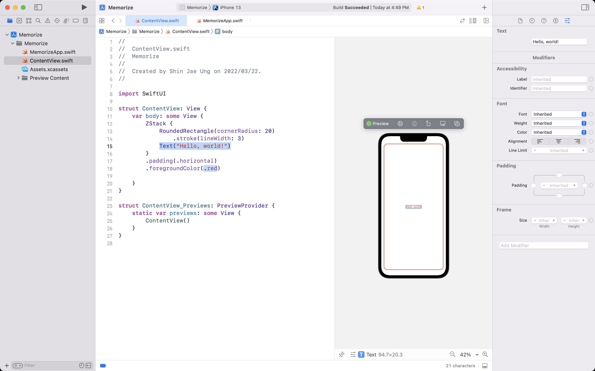
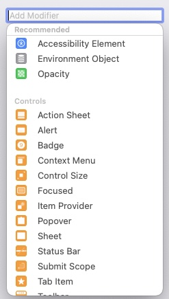

## Lecture 1: Getting started with SwiftUI

## Memorize

 

## Today i learned

- some
    - SwiftUI use **Opaque return types**
        - For performance
        - To use ModifiedContent

- Add modifier
    - You can find Add modifier in inspector area
    - You can add properties in a View

 

- ZStack
    - A view that overlays its children, aligning them
