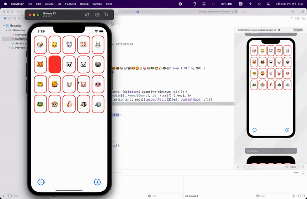

## Lecture 2: Learning more about SwiftUI

## Memorize

 

## Today i learned

- Immutable View
    - SwiftUI View is immutable
    - Entire UI is constantly rebuilt
    - If you want to change a variable in a View use **@State**
        - **@State** points to a memory
        - if the value changes in a memory, the View will get rebuilt

- Identifiable
    - Identifiable just has a hashable id
    - ForEach's contents should be identifiable
        - To adjust the Views from changes

- LazyVGrid
    - LazyGrid creates items only as needed
    - "lazy" doesn't create items until it needs to render them onscreen

- Stroke
    - Stroke draws line on top of the border
    - Some of the line is spilling onto the inside and the outside
    - To ensure all the borders put inside of the boundaries, use `strokeBorder()`
