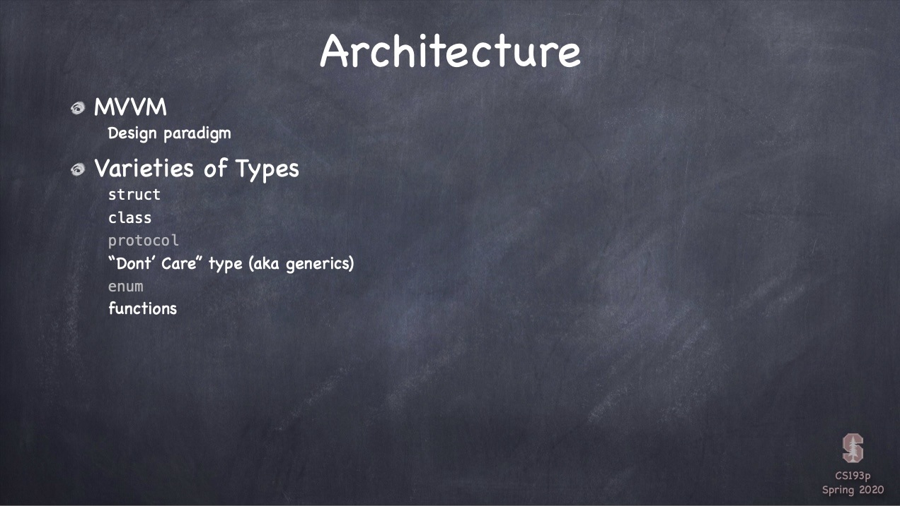
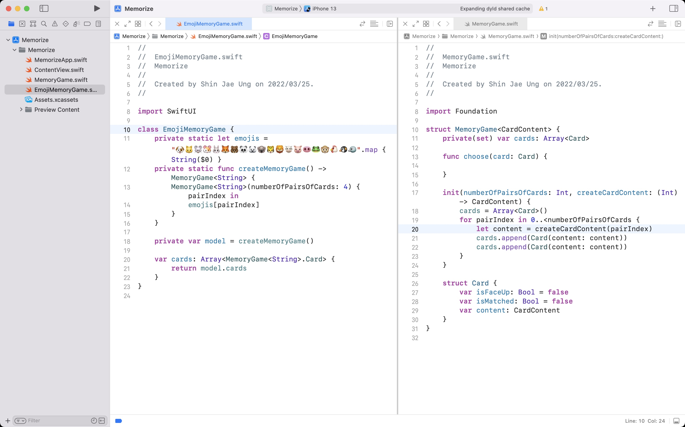
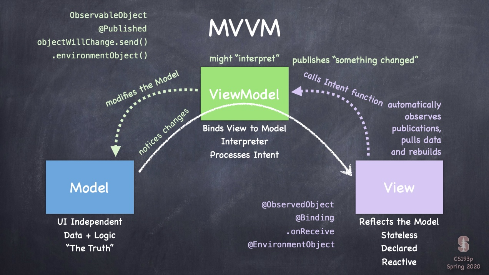
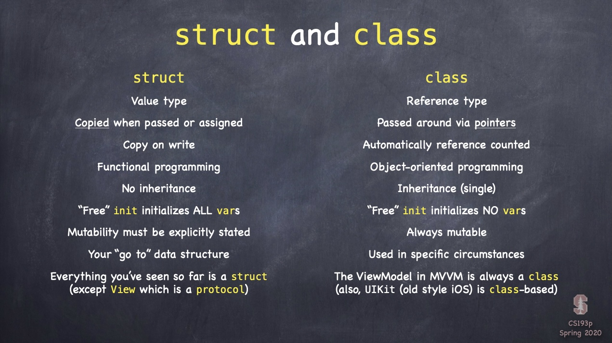
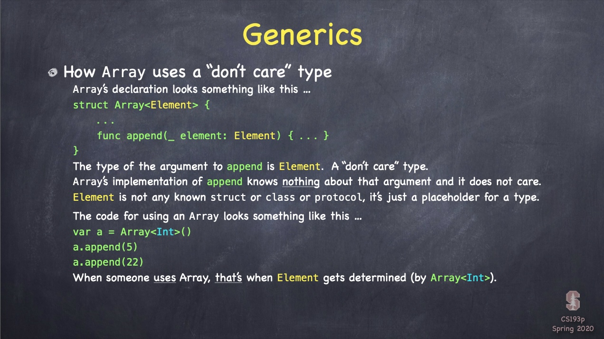

## Lecture 3: MVVM and the Swift type system

 

## Memorize

 

## Today i learned

- [MVVM](#MVVM)
    - Design paradigm

- [Varieties of Types](#Varieties-of-Types)
    - struct
    - class
    - generics
    - functions

 

### MVVM

- Model
    - UI independent
    - Data + Logic

- View
    - Reflects the Model
    - Stateless, Immutable
    - Reactive
    - Subscribing to what the ViewModel is publishing

- ViewModel
    - Binds View to Model
    - Interpreter, Gatekeeper
    - Doesn't have any connections to Views

 

### Varieties of Types

- Struct and Class

 

- Generics

 
