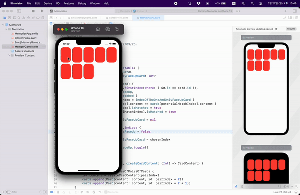
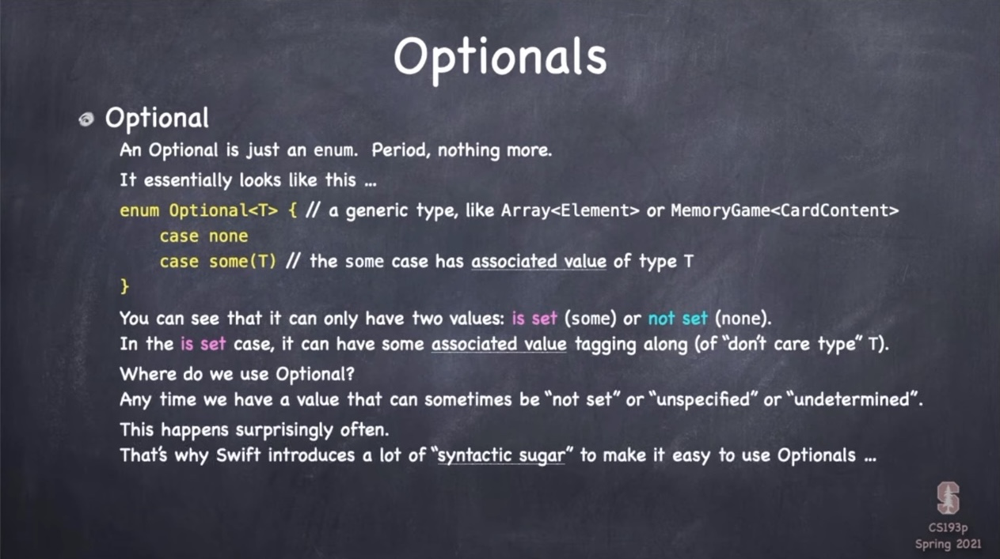

## Lecture 4: More MVVM enum Optionals

 

## Memorize

 

## Today i learned

- [Memorize Game](#Memorize-Game)

- [Varieties of Types](#Varieties-of-Types)
    - enum

- [Optional](#Optional)

 

### Memorize Game

- ObservableObject
    - ObservableObject can publish changes
    - You can use `var objectWillChange: ObservableObjectPublisher`
        - To publish, use `objectWillChange.send()` method
    - Or you can use `@Published` attribute
    - `@observedObject` attribute should be in front of a ObservableObject property

 

### Varieties of Types

 

### Optional

