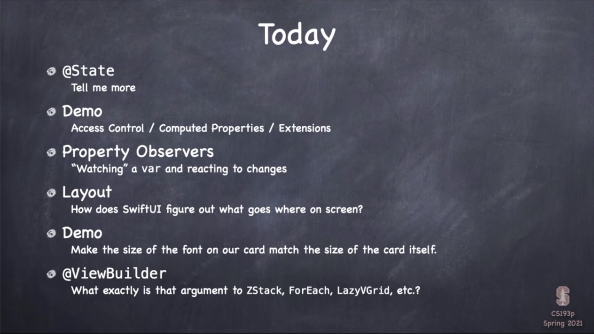
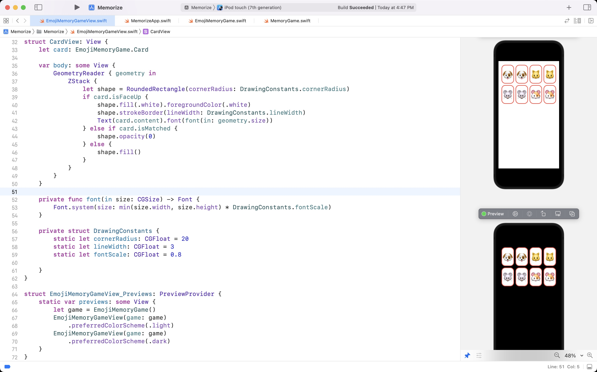
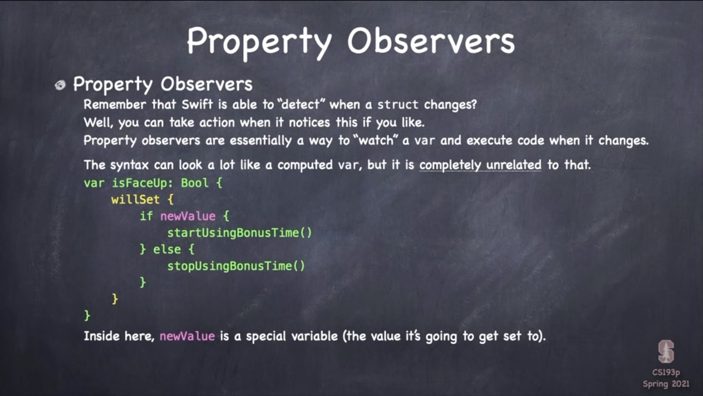

# Lecture 5: Properties Layout @ViewBuilder

 

## Memorize

 

## Today i learned

- [@State](#@State)
- [Property Observers](#Property-Observers)
- [Layout](#Layout)
- [@ViewBuilder](#@ViewBuilder)

 

### @State

- View is Read Only

    - Only lets or computed vars make a View
    - Exception : @ObservedObject, @State

- @State

    - It should be private
    - Changes to this **@State var** will cause a view to rebuild its body
    - If the body gets rebuilt, @State will point to new one

 

### Property Observers

 

### Layout

- View Layout

    - 1. Container Views offer space
    - 2. Views choose their size
    - 3. Container Viws positions the Views
    - 4. (Container Views choose thier size again)

- HStack and VStack
    
    - They offer space to **inflexible** Views first
        
        - Inflexible : Images, Text
        - Flexible : RoundedRectangle

    - Very flexible views will share spare space evenly
    - After that, the stack sizes itself to fit
    - `Spacer(minLength:)`
    
        - Takes all the space offered

    - `Divider()`

        - Draw a divided line
        - Takes the minimum space

    - `.layoutPriority(_:)` to set priority
    - `VStack(alignment:)`, `HStack(alignment:)` for alignment

- LazyHStack and LazyVStack

    - LazyStacks don't build Views not visible
    - They make Views as small as possible

- ScrollView

    - It takes all the space offered to it

- ZStack

    - It sizes itself to fit its children
    - .background modifier
    - .overlay modifier

- Modifiers

    - View modifier functions return a View which contains the View it's modifying

- GeometryReader

    - Always accepts all the space offered to it
    - GeometryProxy
    
        - `var size: CGSize`
        - `func frame(in:) -> CGRect`
        - `var safeAreaInsets: EdgeInsets`

- Safe Area

    - View does not include safe areas generally
    - Way to draw in safe area

        - `ZStack{}.edgesIgnoringSafeArea([.top])`

 

### @ViewBuilder

- @ViewBuilder

    - Any func or read-only computed var can be marked with @ViewBuilder
    - It will be interpreted as a list of Views
