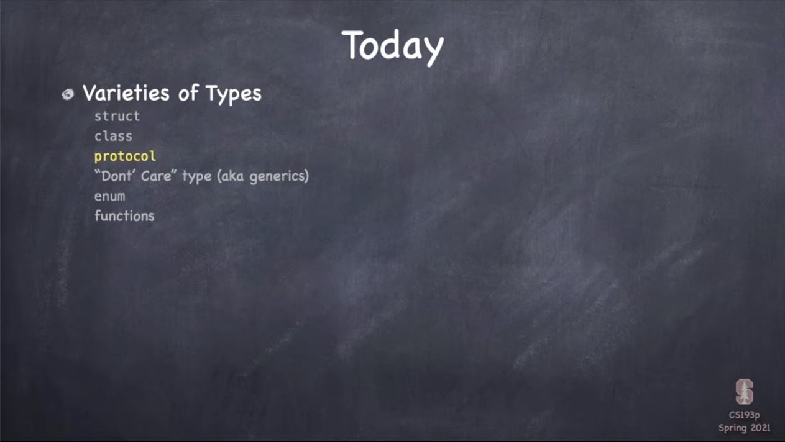
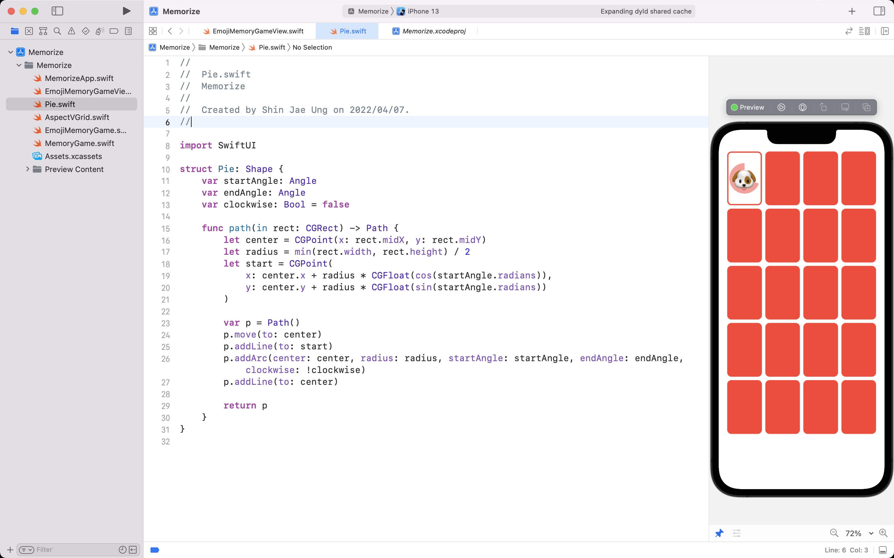

# Lecture 6: Protocols Shapes



<br>

## Memorize



<br>

## Today i learned

- [Protocol](#Protocol)
- [Closure](#Closure)
- [Shape](#Shape)

<br>

### Protocol

- Self-referencing protocol
    - This cannot be used as a normal type
    - ex) `let array = [Equatable]` (x)

<br>

### Closure

- Closure is a Reference type

<br>

### Shape

- draw
    - default: filling with the foreground color
    - .stroke(), .fill()
    ```swift
        func fill<S>(_:) -> some View where S:ShapeStyle
    ```
    - ShapeStyle
        - Color, ImagePaint, AngularGradient, LinearGradient
    - To create own Shape
    ```swift
        func path(in:) -> Path
    ```
