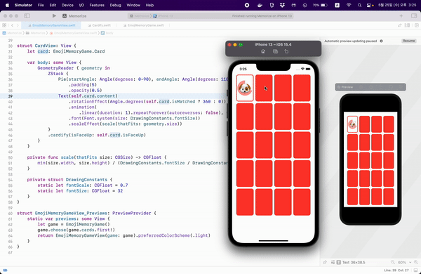

# Lecture 7: ViewModifier Animation


<br>

## Memorize



<br>

## Today i learned

- [ViewModifier](#ViewModifier)
- [Animation](#Animation)

<br>

### ViewModifier

- All functions which Modify Views
- Create a new View

```swift
protocol ViewModifier {
    typealias Content
    func body(content: Content) -> some View {
        return some View
    }
}
```

<br>

### Animation

- Important takeaways about Animation
    - Only changes can be animated
        - ViewModifier arguments
        - Shapes
        - Existence of a View in the UI
    - Animation is showing changes that have already happened
    - A View coming on-screen is only animated if it's joining a container that is already in the UI
    - A View going off-screen is only aminated if it's leaving a container that is staying in the UI

- How to Animate
    - `.animation()`
    - `withAnimation() { }`
    - Making Views be included or excluded from the UI

- Implicit Animation
    - Automatic animation
    - All ViewModifier arguments that **precede** the animation modifier will always be animated
    - It does not work on a container
    - What you can control
        - duration
        - delay
        - repeat (repeatForever)
        - curve(.linear, .easeInOut, .spring)

```swift
Text("👻")
    .opacity(scary ? 1 : 0)
    .rotationEffect(Angle.degrees(upsideDown ? 180 : 0))
    .animation(.easeInOut)
```

- Explicit
    - It crate an animation during all eligible changes
    - **Explicit animations do not override an implicit animation**

```swift
withAnimation(.leanier(duration:2)) {    
}
```

- Transitions
    - Only works for Views that are inside
        - Containers that are already on screen
    - An asymmetric transition has 2 pairs of ViewModifiers
    - AnyTransition
        - opacity, scaling, offset

```swift
ZStack {
    if isFaceUp {
        RoundedRectangle(cornerRadius: 10).stroke()
        Text("👻")
            .transition(.scale)
    } else {
        RoundedRectangle(cornerRadius: 10)
            .transition(.identity)
    }
}
```

- Geometry Effect
    - In its same container
        - `.position`
    - One container to a different container
        - not possible
    - Put a View in each of two containers and then match their geometries
    - `.matchGeomertyEffect(id: Hashable, in: Namespace)`
    - `@Namespace private var myNamespace`

- .onAppear
    - Animations only work on Views that are in **Containers already on screen**
    - Use `.onAppear{ }` to cause a change

- Shape and ViewModifier Animation
    - Actual animation happens in Shapes and ViewModifiers
    - During animation, the system tells the Shape/ViewModifier the current piece it shoule show
    - `var animatableData: Type`
        - Only thing in the Animatable protocol
        - Animatable Shapes and ViewModifiers must implement this protocol
        - `Type` has to implement the protocol `VectorArithmetic`
        - `AnimatablePair` combines two `VectorArithmetics`
