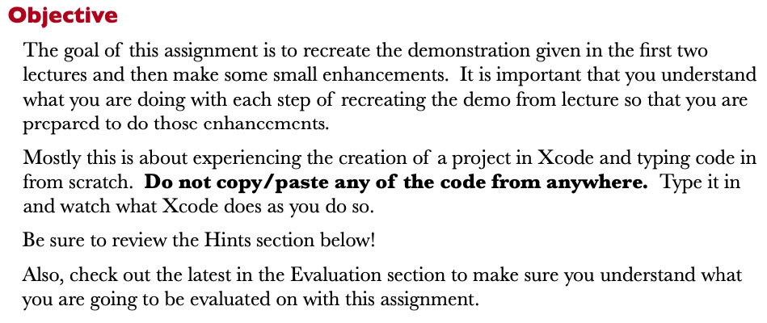
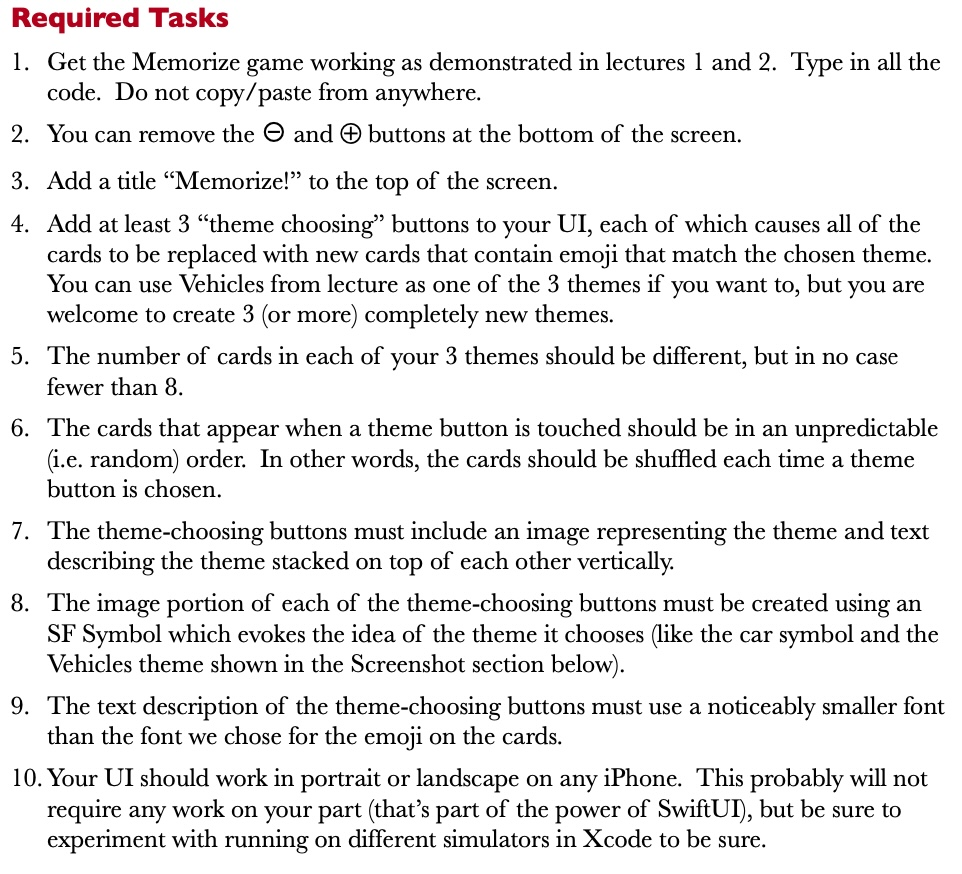
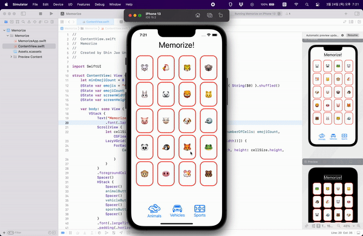
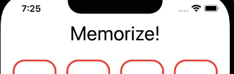

# Assignment 1 : Memorize

[Programming Assignment 1 Pdf📎](./assignment_1.pdf)

<br>
<br>




<br>
 <br>

## Memorize



<br>
 <br>


## Required Tasks

1. Get the Memorize game working as demonstrated in lectures 1 and 2. Type in all the code. Do not copy/paste from anywhere.

    - 완료

2. You can remove the ⊖ and ⊕ buttons at the bottom of the screen.
    
    - -, + 버튼 삭제

3. Add a title “Memorize!” to the top of the screen.

    - 
    

4. Add at least 3 “theme choosing” buttons to your UI, each of which causes all of the cards to be replaced with new cards that contain emoji that match the chosen theme. You can use Vehicles from lecture as one of the 3 themes if you want to, but you are welcome to create 3 (or more) completely new themes.

    - 

5. The number of cards in each of your 3 themes should be different, but in no case fewer than 8.

    - ```swift
        let minEmojiCount = 8         
      ```

6. The cards that appear when a theme button is touched should be in an unpredictable (i.e. random) order. In other words, the cards should be shuffled each time a theme button is chosen.

    - ```swift
        self.emojiCount = Int.random(in: minEmojiCount...emojis.count)        
      ```


7. The theme-choosing buttons must include an image representing the theme and text describing the theme stacked on top of each other vertically.

    - 

8. The image portion of each of the theme-choosing buttons must be created using an SF Symbol which evokes the idea of the theme it chooses (like the car symbol and the Vehicles theme shown in the Screenshot section below).

    - ```swift
        Image(systemName: "hare")
      ```

9. The text description of the theme-choosing buttons must use a noticeably smaller font than the font we chose for the emoji on the cards.

    - ```swift
        Text("Animals").font(.body)
      ```


10. Your UI should work in portrait or landscape on any iPhone. This probably will not require any work on your part (that’s part of the power of SwiftUI), but be sure to experiment with running on different simulators in Xcode to be sure.

    - 모든 iPhone에서 사용가능
