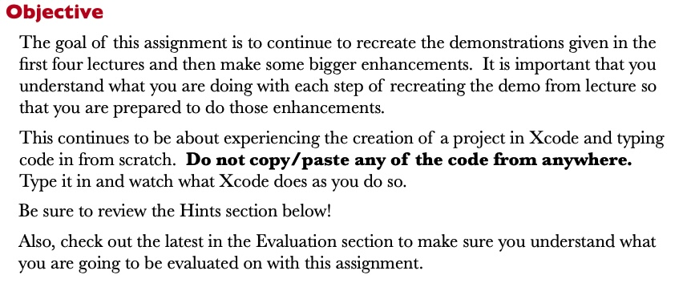
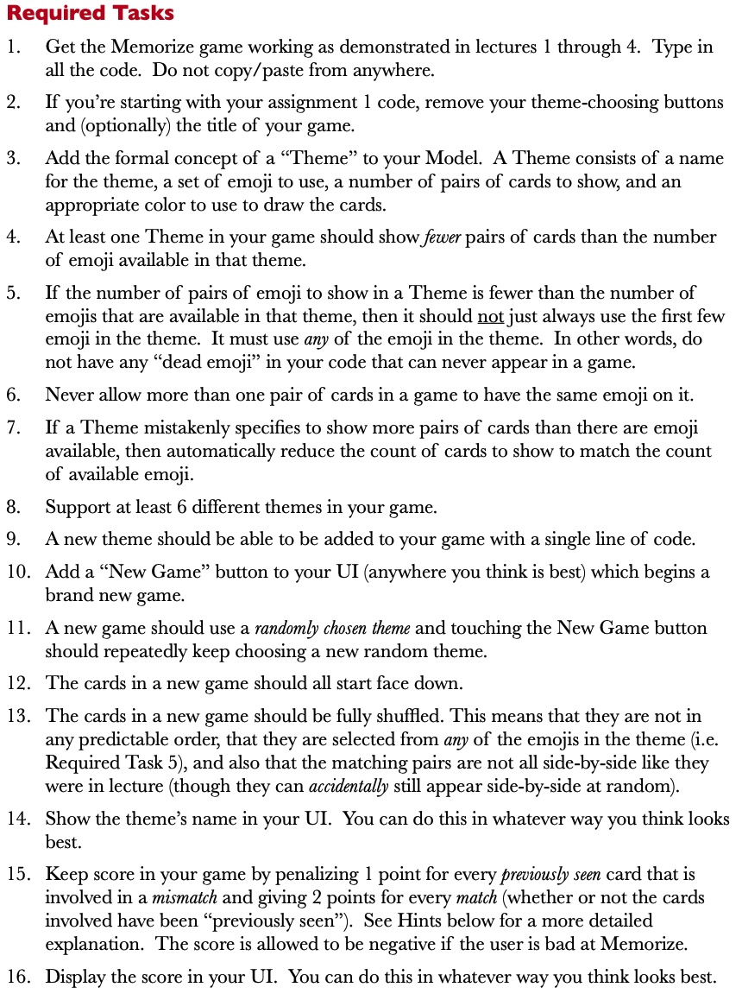
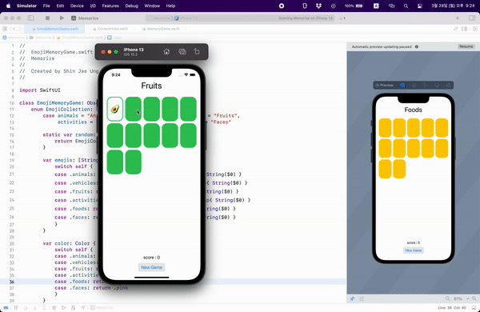
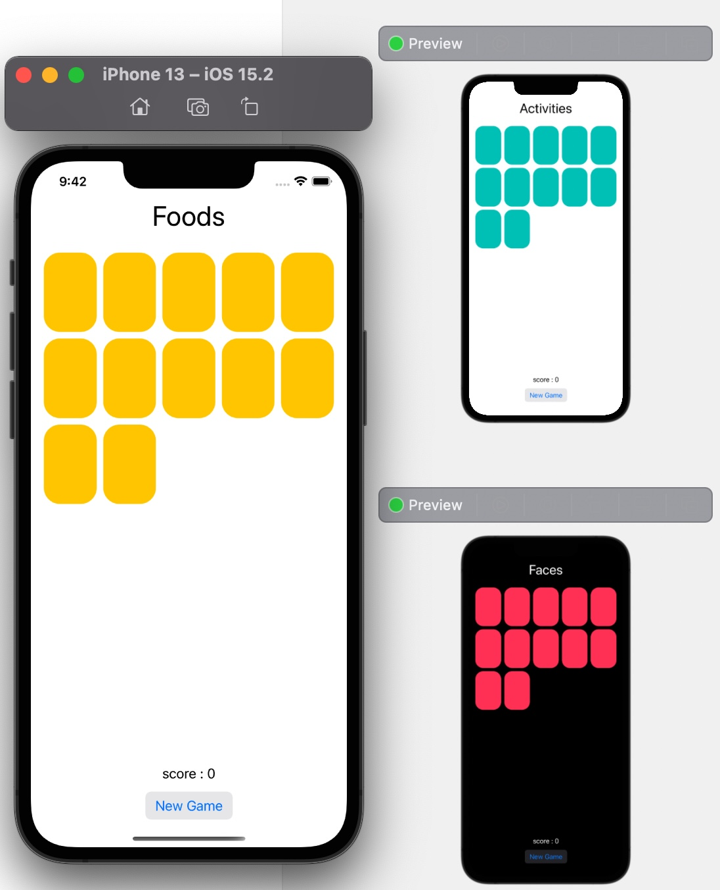

# Assignment 2 : More Memorize

[Programming Assignment 2 Pdf📎](./Assignment%202.pdf)

<br>
 <br>




<br>
 <br>

## Memorize



<br>
 <br>


## Required Tasks


1. Get the Memorize game working as demonstrated in lectures 1 through 4. Type in all the code. Do not copy/paste from anywhere.

    - lecture 4를 토대로 완성


2. If you’re starting with your assignment 1 code, remove your theme-choosing buttons and (optionally) the title of your game.

    - theme-choosing buttons 삭제


3. Add the formal concept of a “Theme” to your Model. A Theme consists of a name for the theme, a set of emoji to use, a number of pairs of cards to show, and an appropriate color to use to draw the cards.

    - theme의 종류에 따라 title과 card 색이 변경됨

    - 

<br>

4. At least one Theme in your game should show fewer pairs of cards than the number of emoji available in that theme.

    - 모든 emoji는 각 10개 씩이며, 이 중 6개의 pairs만 표현 됨

    - ```swift
      var emojis: [String] {
            switch self {
            case .animals: return "🐶🐱🐭🐹🐰🦊🐻🐼🐻‍❄️🐨".map{ String($0) }
            case .vehicles: return  "🚗🛳🏍🚌🚁🏎🚑🚒✈️🚆".map{ String($0) }
            case .fruits: return "🍎🍉🍇🍓🍒🥝🍆🥑🍍🫐".map{ String($0) }
            case .activities: return "⚽️🏈🏀🎾⛷🥊🥋🪂🛹⛳️".map{ String($0) }
            case .foods: return "🥟🍤🍡🍭🍪🍫🍔🌭🍖🥨".map{ String($0) }
            case .faces: return "😡🤯🥶😱🤢😈👹🤡🎃👽".map{ String($0) }
            }
        }
        ```

5. If the number of pairs of emoji to show in a Theme is fewer than the number of emojis that are available in that theme, then it should not just always use the first few emoji in the theme. It must use any of the emoji in the theme. In other words, do not have any “dead emoji” in your code that can never appear in a game.

    - theme에서 emojis가 선택되면, 이를 `shuffled()`한 후, `removeFirst()`로 emoji를 선택하였음

    - ```swift
        private func createMemoryGame() -> MemoryGame<String> {
            let emojiCollection = EmojiCollection.random
            var emojis = emojiCollection.emojis.shuffled()
            /* ... */
            return MemoryGame<String>(numberOfPairsOfCards: 6) { _ in
                return emojis.removeFirst()
            }
        }
        ```
    
6. Never allow more than one pair of cards in a game to have the same emoji on it.

    - 동일한 emoji를 사용하지 않아 중복 미발생


7. If a Theme mistakenly specifies to show more pairs of cards than there are emoji available, then automatically reduce the count of cards to show to match the count of available emoji.

    - 6개 보다 적을경우, emojis의 갯수 만큼 사용하도록 함

    - ```swift
       let numberOfPairs = emojis.count >= 6 ? 6 : emojis.count
       ```

8. Support at least 6 different themes in your game.

    - themes는 총 6개

    - ```swift
        enum EmojiCollection: String, CaseIterable {
            case animals = "Animals", vehicles = "Vehicles", fruits = "Fruits",
            activities = "Activities", foods = "Foods", faces = "Faces"
        /* ... */
        }   
       ```

9. A new theme should be able to be added to your game with a single line of code.

    - 한 줄의 code로 theme 추가 가능

    - ```swift
      var emojis: [String] {
            switch self {
            case .animals: return "🐶🐱🐭🐹🐰🦊🐻🐼🐻‍❄️🐨".map{ String($0) }
            case .vehicles: return  "🚗🛳🏍🚌🚁🏎🚑🚒✈️🚆".map{ String($0) }
            case .fruits: return "🍎🍉🍇🍓🍒🥝🍆🥑🍍🫐".map{ String($0) }
            case .activities: return "⚽️🏈🏀🎾⛷🥊🥋🪂🛹⛳️".map{ String($0) }
            case .foods: return "🥟🍤🍡🍭🍪🍫🍔🌭🍖🥨".map{ String($0) }
            case .faces: return "😡🤯🥶😱🤢😈👹🤡🎃👽".map{ String($0) }
            }
        }
        ```

10. Add a “New Game” button to your UI (anywhere you think is best) which begins a brand new game.

    - 하단에 배치

    - 

<br>

11. A new game should use a randomly chosen theme and touching the New Game button should repeatedly keep choosing a new random theme.

    - new game button touch시 새로운 memory game을 만들도록 함
    
    - ```swift
        func newGame() {
            self.model = self.createMemoryGame()
        }
      ```


12. The cards in a new game should all start face down.

    - 재시작시 항상 face down으로 시작

    - ```swift
        struct Card: Identifiable {
            var isFaceUp: Bool = false
            var isMatched: Bool = false
            var content: CardContent
            var id: Int
        }
        ```

13. The cards in a new game should be fully shuffled. This means that they are not in any predictable order, that they are selected from any of the emojis in the theme (i.e. Required Task 5), and also that the matching pairs are not all side-by-side like they were in lecture (though they can accidentally still appear side-by-side at random).

    - MemoryGame model 초기화시 `shuffle()`으로 위치를 무작위로 두도록 함
    
    - ```swift
        init(numberOfPairsOfCards: Int, createCardContent: (Int) -> CardContent) {
            cards = Array<Card>()
            for pairIndex in 0..<numberOfPairsOfCards {
                let content = createCardContent(pairIndex)
                cards.append(Card(content: content, id: pairIndex * 2))
                cards.append(Card(content: content, id: pairIndex * 2 + 1))
            }
            cards.shuffle()
        }
        ```

14. Show the theme’s name in your UI. You can do this in whatever way you think looks best.

    - 화면 상단에 이름 표시


15. Keep score in your game by penalizing 1 point for every previously seen card that is involved in a mismatch and giving 2 points for every match (whether or not the cards involved have been “previously seen”). See Hints below for a more detailed explanation. The score is allowed to be negative if the user is bad at Memorize.

    - user가 card 2개를 선택 후
        - 맞췄을 경우 : 2점 획득
        - 못맞췄을 경우
            - 각 card가 checkedCard에 속하면 -1점
            - 각 card를 checkedCard에 update

16. Display the score in your UI. You can do this in whatever way you think looks best.

    - New Game button 위에 배치함

    - 
