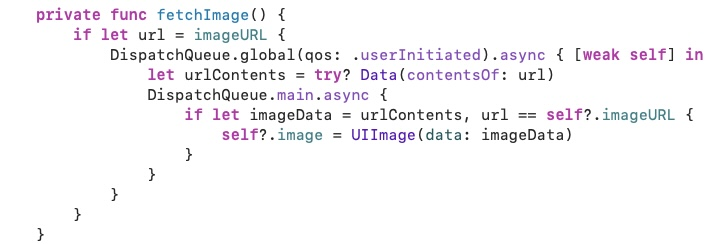

# Chapter10 : 멀티 쓰레드와 오토레이아웃


<br>
 <br>

## Cassini


<br>
 <br>
 
## Concentration


<br>
 <br>

## Today i learned

- [Multithreading](#Multithreading)
- [Cassini](#Cassini)
- [Autolayout](#Autolayout)
- [Concentration](#Concentration)

<br>
 <br>

### Multithreading


- Reason
    - We want to keep long running things off of the main queue where the UI runs
    - UI should be incredibly responsible

- Queues
    - kind
        - Serial
        - Concurrent

- Main Queue
    - Serial queue
    - Code blocks for UI always execute here
    - `DispatchQueue.main`

- Global Queue
    - Concurrent queue
    - `DispatchQueue.global(qos: DispatchQoS)`
        - DispatchQoS.userInteractive
        - DispatchQoS.userInitiated
        - DispatchQoS.background
        - DispatchQos.utility

- Way to put on the Queue
    - async
        - just plop a closure
    - sync
        - block queue waiting until the closure finishes

- Getting a non-global queue
    - `let serialQueue = DispatchQueue(label: 
"MySerialQ")`
    - `let concurrentQueue = DispatchQueue(label: "MyConcurrentQ", attributes: .concurrent)`

- Another API
    - Operation
    - OperationQueue


- Multithreading iOS API
    - summary: a b g h c d f e

```swift
a:    let session = URLSession(configuration: .default)
b:    if let url = URL(string: "http://stanford.edu/...") {
c:        let task = session.dataTask(with: url) { (data: Data?, response, error) in
d:            DispatchQueue.main.async {
e:                // UI stuff
              }
f:            print("did some stuff with the data, but UI part hasn't happened yet")
          }
g:        task.resume()
      }
h:    print("done firing off the request for the url's contents")
```

<br>
 <br>
 
### Cassini

 

- Error
    - `prepare(for: seque)` is before the outlet is set
    - Use optional chaining


- Weak reference

    - self does not have a pointer to this closure
    - so there is no reference cycle
    - **but** if the view controller disappears while the closure is running, view controller will be captured in the heap



- Reallocate problem
    - `fetchImage()` can be called multiple times
    - so we need to check if the request is the last one
    - checking our current image url is the requested one will be the solution

<br>
 <br>
 
### Autolayout

 

- Size Classes
    - iPhone
        - 🚦 : compact width, **regular** height
        - 🚥 : compact width, compact height
    - iPhone Plus
        - 🚦 : compact width, **regular** height
        - 🚥 : compact width, **regular** height
    - iPad
        - 🚦 : **regular** width, **regular** height
        - 🚥 : **regular** width, **regular** height
        - Split View: master has compact width

- Usage of size class
    - Vary properties(font, background, hidden...)
    - Include or Exclude constraints

<br>
 <br>

### Concentraion

- Vary for Traits


- Constraint
    - Vary for Traits is deprecated on Xcode 13
    - Use Install instead
