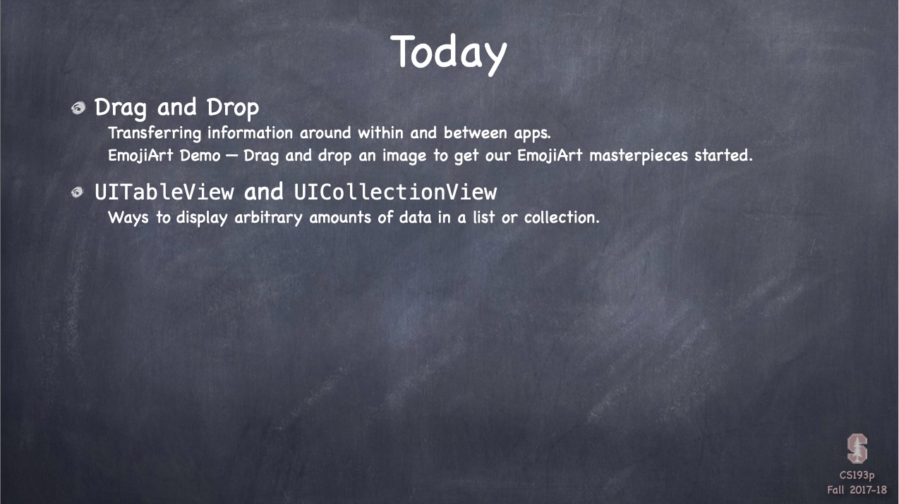
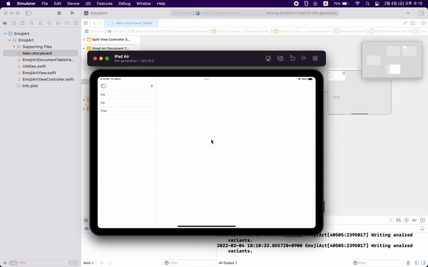
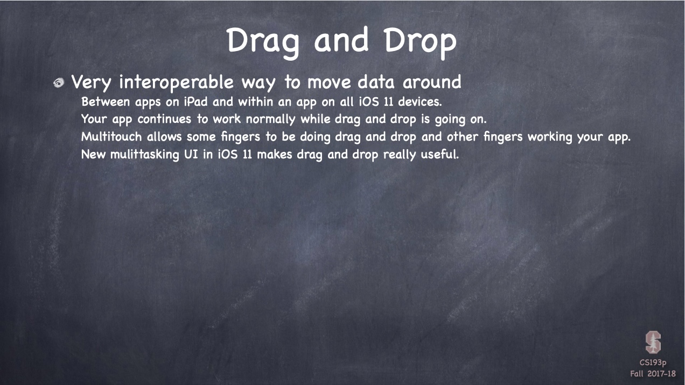
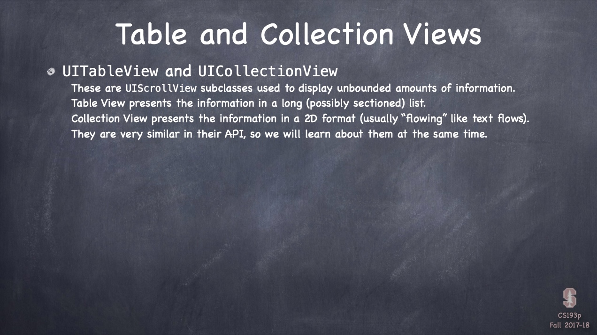
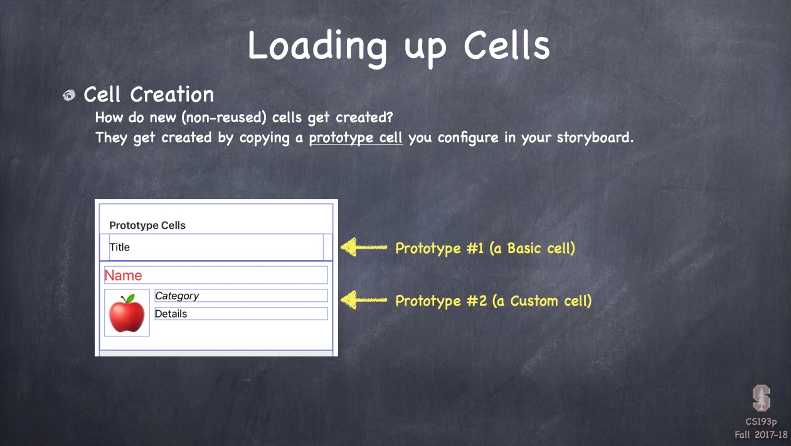
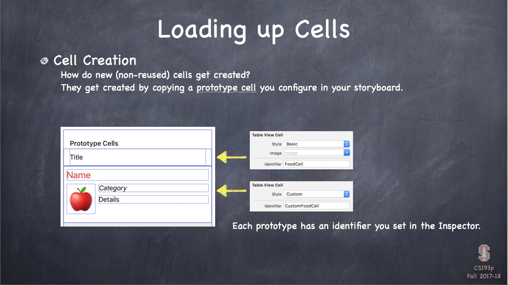
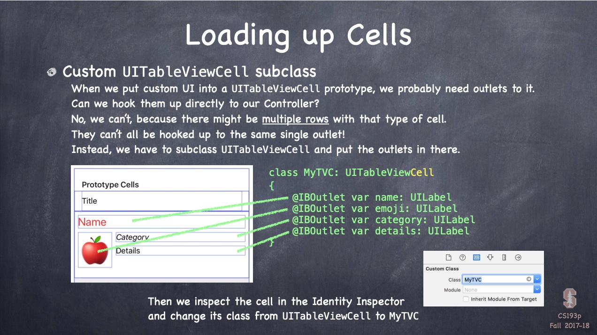
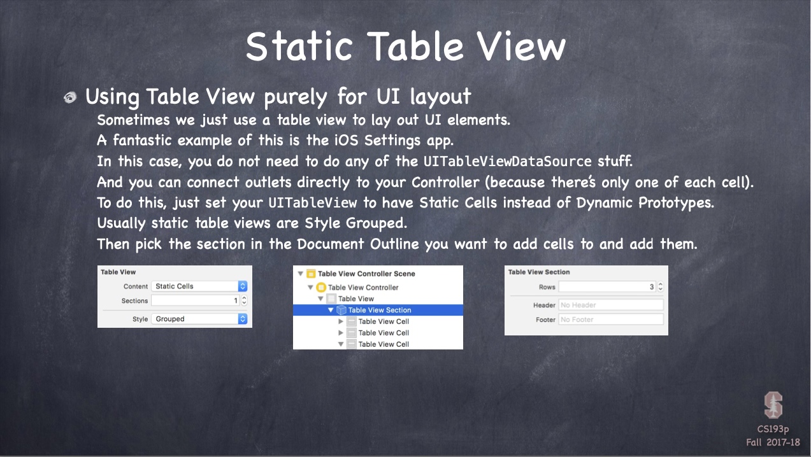

# Chapter11 : 드레그 & 드랍, 테이블뷰와 컬렉션 뷰 - Part 1



<br>
 <br>

## EmojiArt



<br>
 <br>

## Today i learned

- [Drag and Drop](#Drag-and-Drop)
- [UITableView and UICollectionView](#UITableView-and-UICollectionView)
- [EmojiArt](#EmojiArt)

<br>
 <br>

### Drag and Drop



- Drag and Drop
    - Multitouch allows while on drag and drop
    - New Muititasking allows drag and drop like desktop
    - It works within an app or **between apps(only iPad)**

- Implement
    - UIView has a method `addInteraction()`

    ```swift
    let drag/dropInteraction = UIDrag/DropInteraction(delegate: )
    view.addInteraction(drag/dropInteraction)
    ```

- Starting a drag
    - When user makes a drag, the delegate gets
        - `func dragInteraction(_:, itemsForBeginning:) -> [UIDragItem]`
    - UIDragItem looks like
        - `let dragItem = UIDragItem(itemProvider: NSItemProvider(object: provider))`
        - Providers: NSAttributedString, NSString, UIImage, NSURL, UIColor, MKMapItem, CNContact.
    - Drag and drop inside your own app
        - `dragItem.localObject = someObject`
        - Any type can be done

- Adding to a drag
    - In the middle of a drag, users can add more
        - `func dragInteraction(_:, itemsForAddingTo:) -> [UIDragItem]`

- Accepting a drop
    - When a drag moves over a view, the delegate gets
        - `func dropInteraction(_:, canHandle:) -> Bool`
        - Delegate can refuse
    - The delegate can ask
        - `let stringAvailable = session.canLoadObject(ofClass: NSAttributedString.self)`
        - `let imageAvailable = session.canLoadObjects(ofClass: UIImage.self)`
    - If you don't refuse
        - `func dropInteraction(_ :, sessionDidUpdate:) -> UIDropProposal`
        - `UIDropProposal(operation: .copy/.move/.cancel)`
    - Where the finger is
        - `session.location(in: view)`
    - If all goes well
        - `func dropInteraction(_:, performDrop:)`
        - `session.loadObject(ofClass:, completionHandler:)`
            - This closure will be executed on **the main queue**
    
<br>
 <br>
 
### UITableView and UICollectionView



- UITableView
    - list
    - section
    - simple ancillary information
        - Subtitle style
        - Left Detail style
        - Right Detail style
        - Basic style
    - custom
    - grouped

- UICollectionView
    - 2D arrangement, but by default it flows the items
    - Only custom layout

- Data and Delegate
    - UITableView
        - `var dataSource: UITableViewDataSource`
        - `var delegate: UITableViewDelegate`
    - UICollectionView
        - `var dataSource: UICollectionViewDataSource`
        - `var delegate: UICollectionViewDelegate`

- Datasource protocol
    - UITableView
        - `func numberOfSections(in:) -> Int`
        - `func tableView(_:, numberOfRowsInSection:) -> Int`
        - `func tableView(_:, cellForRowAt:) -> UITableViewCell`

    - UICollectionView
        - `func numberOfSections(in:) -> Int`
        - `func collectionView(_:, cellForItemAt:) -> UICollectionViewCell`
        - `func collectionView(_:, cellForItemAt:) -> UICollectionViewCell`

 

- Cell Reuse
    - For efficiency, tableView reuses the cells
    - `dequeueReusableCell(withIdentifier:)` get created by copying a **prototype cell** of storyboard
    - **Reuses have serious implications for multithreading**



- Custom UITableViewCell
    - To put the outlets, you should subclass UITableViewCell

- Implementing cellForRowAt

```swift
    func tableView(_ tv: UITV, cellForRowAt indexPath: IndexPath) -> UITableViewCell {
        let prototype = decision ? “FoodCell” : “CustomFoodCell”
        let cell = tv.dequeueReusableCell(withIdentifier: prototype , for: indexPath)
        if let myTVCell = cell as? MyTVC {
            myTVC.name = food(at: indexPath); myTVC.emoji = emoji(at: indexPath)
        }
    }
```



- Static Table View
    - You don't need UITableViewDataSource
    - You can connect outlets directly to your controller
    
- TableView Segue
    
```swift
    func prepare(for segue: UIStoryboardSegue, sender: Any?) {
        if let identifier = segue.identifier {
            switch identifier {
            case “XyzSegue”: // handle XyzSegue here
            case “AbcSegue”:
                if let cell = sender as? MyTableViewCell,
                let indexPath = tableView.indexPath(for: cell),
                let seguedToMVC = segue.destination as? MyVC {
                    seguedToMVC.publicAPI = data[indexPath.section][indexPath.row]
                }
            default: break
            }
        }
    }
```

- Collection View Segue
    - `func collectionView(collectionView:, didSelectItemAtIndexPath:)`

- Model changes
    - `func reloadData()`
    - `func reloadRows(at:, with:)`

- Controlling the height of rows
    - `var rowHeight: CGFloat`
    - `var estimatedRowHeight: CGFloat`
    - `rowHeight = UITableViewAutomaticDimension`
    - `func table(_:, heightForRowAt:) -> CGFloat`
    - `func collectionView(_:, layout:, sizeForItemAt:) -> CGSize`
        - default: flow layout

- Headers
    - `func tableView(_:, titleForHeaderInSection:) -> String?`
    - `func collectionView(_:, viewForSupplementaryElementOfKind:, at:) -> UICollectionReusableView`

<br>
 <br>

### EmojiArt

- Reason why tableView is embeded in navigationController
    - In splitView, master view can compact
    - So it turns into a navigationController
