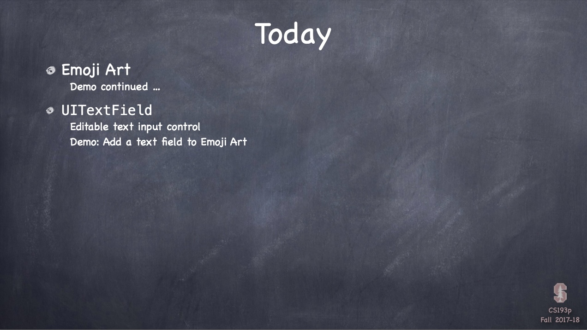
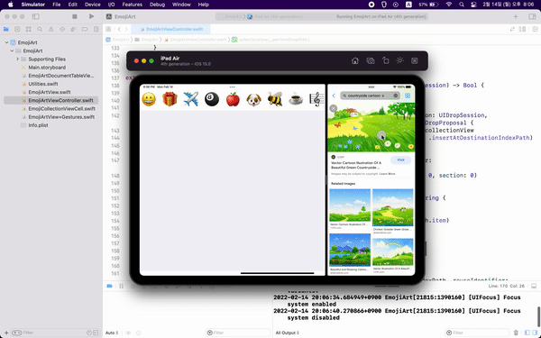
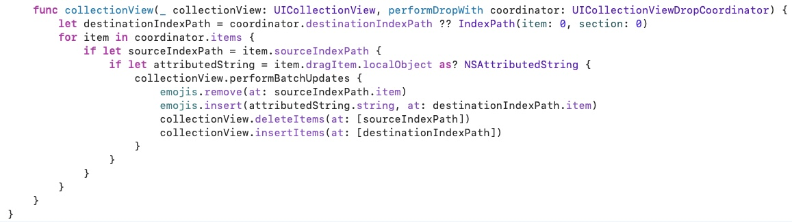

# Chapter12 : 드레그 & 드랍, 테이블뷰와 컬렉션 뷰 - Part 2

 
  

## EmojiArt

 
  

## Today i learned

- [Emoji Art](#Emoji-Art)
- [UITextField](#UITextField)

 
  

### Emoji Art

- performBatchUpdates
    - If you want to make multiple changes to the collectionView in one single operation
    - Make sure collectionView and model are in sync

 
  

### UITextField

- Like UILabel, but editable
    - Don't be fooled by your UI in the simulator

- Keyboard appears
    - When UITextfield becomes **first responder**
    - Disappear when **resign responder**

- Delegate with return key
    - `func textFieldShouldReturn(sender: UITextField) -> Bool`
    - `sender.resignFirstResponder()`

- Editing has ended
    - `func textFieldDidEndEditing(sender: UITextField)`

- Keyboard appearance
    - `var autocapitalizationType: UITextAutocapitalizationType`
    - `var autocorrectionType: UITextAutocorrectionType`
    - `var returnKeyType: UIReturnKeyType`
    - `var isSecureTextEntry: Bool`
    - `var keyboardType: UIKeyboardType`

- Accessory
    - `var inputAccessoryView: UIView`

- Keyboard notifications
    - UIKeyboard{Will,Did}{Show,Hide} notifications

- Other UITextField properties
    - `var clearsOnBeginEditing: Bool`
    - `var adjustsFontSizeToFitWith: Bool`
    - `var minimumFontSize: CGFloat`
    - `var placeholder: String?`
    - `var background/disableBackground: UIImage?`
    - `var defaultTextAttributes: [String:Any]`

