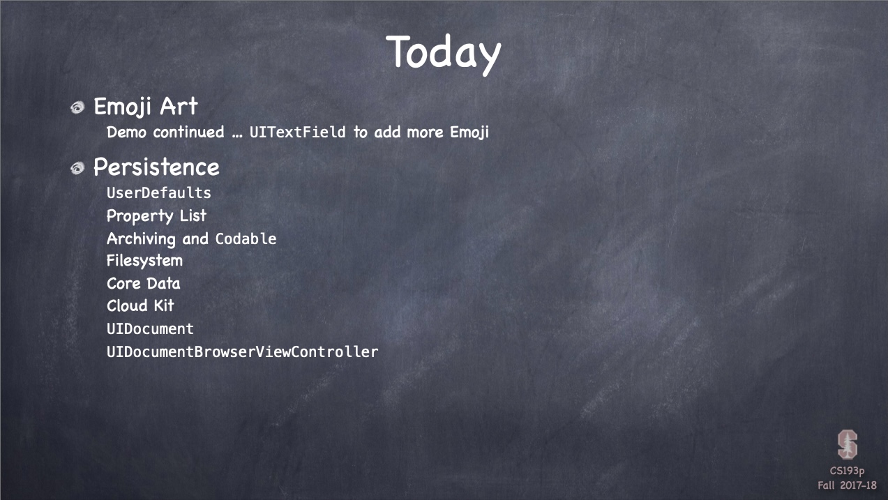
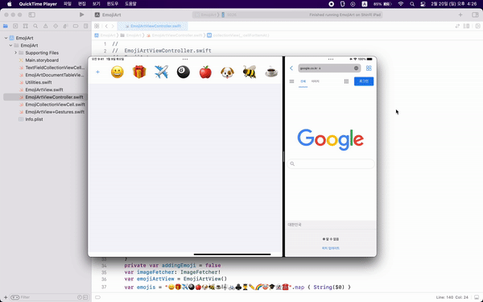
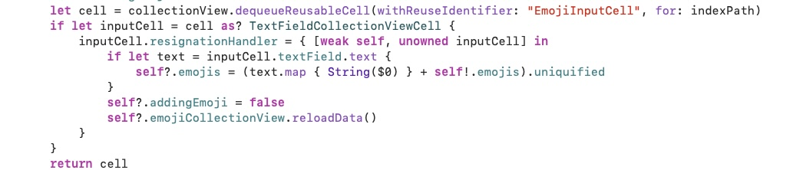
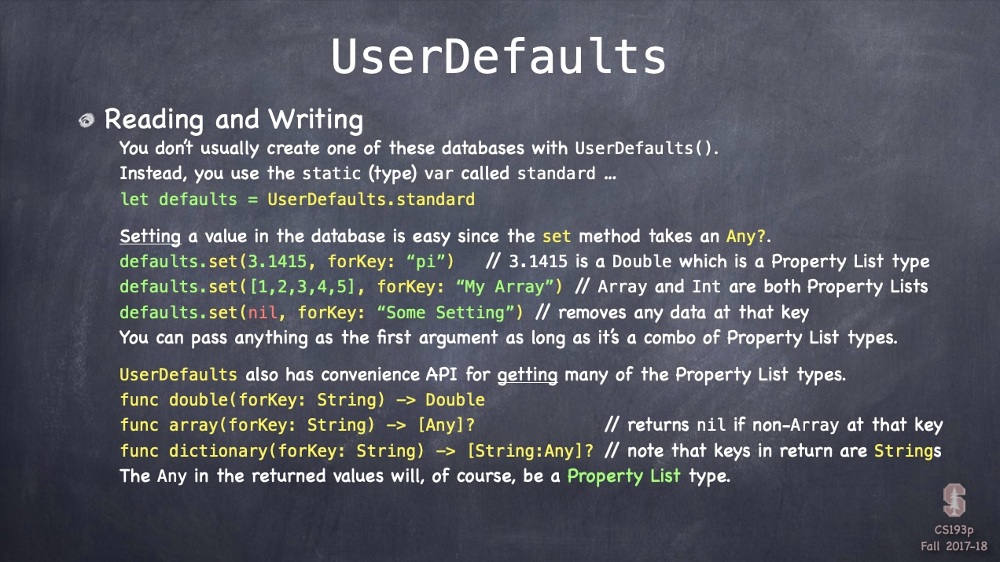
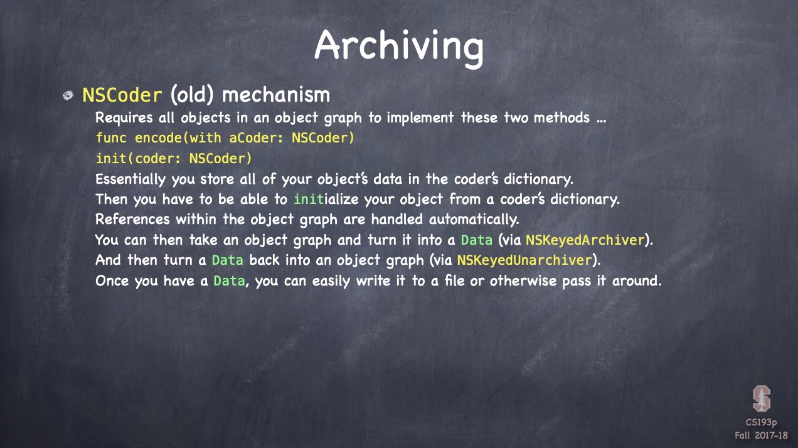
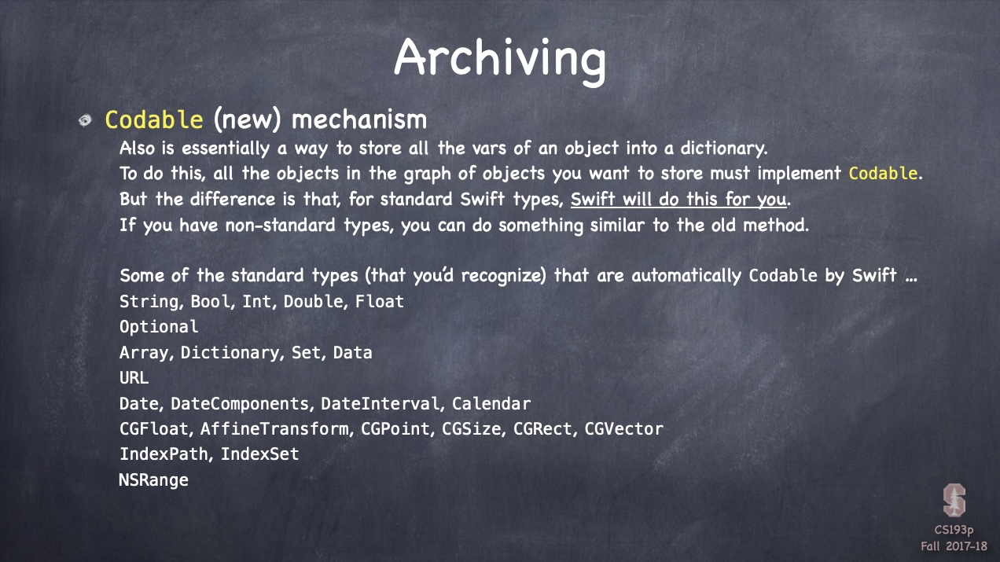
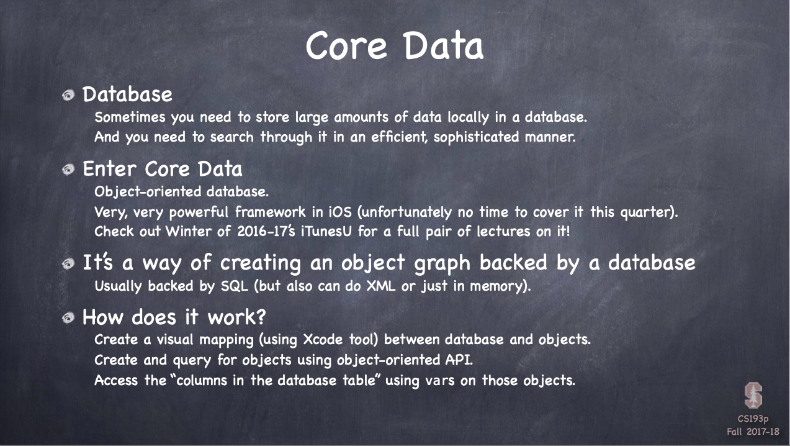

# Chapter13 : 데이터 저장하기와 도큐멘트 - 이론



<br>
 <br>

## EmojiArt



<br>
 <br>

## Today i learned

- [Emoji Art](#Emoji-Art)
- [Persistence](#Persistence)

<br>
 <br>

### Emoji Art



- Reference Cycle
    - weak self
        - CollectionView points to Cell `if let inputCell`
        - Cell points to Closure `inputCell.resignationHander`
        - Closure points to CollectionView `self?.emojis`
    - unowned inputCell
        - Cell points to Closure `inputCell.resignationHander`
        - Closure points to Cell `{ inputCell.textField.text }`

<br>
 <br>

### Persistence



- UserDefaults
    - Do not use it for anyting big
    - Property List
        - Array, Dictionary, String, Date, Data, Numbers
    - `UserDefaults.standard.set(_, forKey:)`
    - `UserDefaults.standard.object(forKey:)`
    - Saving
        - Autosaved
        - Force to save : `UserDefaults.standard.synchronized()`

<br>

 

- Archiving
    - NSCoder
        - NSKeyedArchiver
        - NSKeyedUnarchiver
    - Codable
        - Automatically Codable Types
            - String, Bool, Int, Double, Float
            - Optional
            - Array, Dictionary, Set, Data
            - URL
            - Date, DateComponents, DateInterval, Calendar
            - CGFloat, AffineTransform, CGPoint, CGSize, CGRect, CGVector
            - IndexPath, IndexSet
            - NSRange
        - You can convert object graph to a **JSON** or **Property List**
        - If you want to see a String
            - `let jsonString = String(data: jsonData!, encoding: .utf8)`
        - To get an object, use **JSONDecoder()** 
        - JSON Date or URL are just strings. For configuration
            - `decoder.dateDecodingStrategy = .iso8701`
        - DecodingErrors are Enum
        - You can use **private enum** CodingKeys for keys which might have different names
        - You can implement `init(from decoder: Decoder)` when swift can't decode
            - For class, you should call`super.init(from: superDecoder)`

<br>

- File System
    - iOS is Unix. You can only read and write in "sandbox"
        - For Security, Privacy, Clean up
    - Application directory - Not writable
        - .storyboards, .jpgs, etc.
    - Documents directory - Permanent storage. Always visible by the user
    - Application Support directory - Permanent storage. Not be seen directly by the user
    - Cache directory - temporary files
    - Other directories...

    - ```swift
        let url: URL = FileManager.default.URL(
            for directory: FileManager.SearchDirectory.documentDirectory,
            in domainMask: .userDomainMask // always .userDomainMask on iOS
            appropriateFor: nil, // only meaningful for "replace" file operations
            create: true
        )
      ```

    - Appending 
        - `func appendingPathComponent(String) -> URL`
        - `func appendingPathExtension(String) -> URL`

    - Finding
        - `var isFileURL: Bool`
        - `func resourceValues(for keys: [URLResourceKey]) throws -> [URLResourceKey: Any]?`
    - Reading dinary data from a URL
        - `init(contentsOf: URL, options: Data.ReadingOptions) throws`
    - Writing dinary data to a URL
        - `func write(to url:URL, options: Data.WriteOptions) throws -> Bool`
    - FileManager
        - Provides utility operations
        - FileManager is **Threat safe** without main thread
        - FileManager.default is in the main thread

<br>



- Core Data
    - Large amount of data in local database(SQL)
    - Create a visual mapping between database and objects
    - Access 
        - `NSManagedObjectedContext`
    - Deleting
        - `context.delete(_:)`
    - Saving
        - `try context.save()`
        - Use UIManagedDocument to autosave
    - Searching
        - ```swift
          let request: NSFetchRequest<TwitterUser> = TwitterUser.fetchRequset()
          let yesterday = Date(timeIntervalSinceNow: -24*60*60) as NSDate
          request.predicate = NSPredicate(format: "any tweets.created > %@", yesterday)
          request.sortDescriptors = [NSSortDescriptor(key: "name", ascending: true)]
          
          let recentTweeters = try? context.fetch(request)
          ```
    - More things
        - Very efficient
        - Support for multithreading
        - Close integration with UITableView (for obvious reasons)
        - Optimistic locking (deleteConflictsForObject)
        - Rolling back unsaved changes
        - Undo/Redo
        - Staleness (how long after a fetch until a refetch of an object is required?)

<br>

- Cloud Kit
    - A database in the cloud
    - [[Setting Up Core Data with CloudKit]](https://developer.apple.com/documentation/coredata/mirroring_a_core_data_store_with_cloudkit/setting_up_core_data_with_cloudkit)
    - Dynamic schema Creation
    - ```swift
      let db = CKContainer.default.publicCloudDatabase
      let tweet = CKRecord(“Tweet”)
      tweet[“text”] = “140 characters of pure joy”
      let tweeter = CKRecord(“TwitterUser”)
      tweet[“tweeter”] = CKReference(record: tweeter, action: .deleteSelf)
      db.save(tweet) { (savedRecord: CKRecord?, error: NSError?) -> Void in }
      ```
    - Query
        - ```swift
          let db = CKContainer.default.publicColudDatabase
          let predicate = NSPredicate(format: "text contains %@", searchingString)
          let query = CKQuery(recordType: "Tweet", predicate: predicate)
          db.perform(query) { (record: [CKRecord?], error: NSError?) in }
          ```

<br>


- UIDocument
    - UIDocument autosaves
    - Subclassing UIDocument
        - ```swift
          class EmojiArtDocument: UIDocument {
              var emojiArt: EmojiArt?
          }
          ```
    - Creating a UIDocument
        - ```swift
          var url = FileManager.urls(for: .documentDirectory, in: .userDomainMask).first!
          url = url.appendingPathComponent("Name.extention")
          let myDocument = EmojiArtDocument(fileURL: url)
          ```
    - Creating a Data from Model
        - ```swift
          override func contents(forType typeName: String) throws -> Any {
              return // emojiArt -> Data
          }
          ```
    - Data into a Model
        - ```swift
          override func load(fromContents:, ofType) throws {
              return // contents -> Model
          }
          ```
    - How to open
        - ```swift
          myDocument.open { success in
              if success { }
              else { }
          }
          ```
    - Saving
        - `myDocument.updateChangeCount(.done)` // autosave
        - ```swift
          let url = myDocument.fileURL
          myDocument.save(to: url: URL, for: UIDocumentSaveOperation) { success in
              if success { }
              else { }
          }
          ```
    - Closing
        - ```swift
          myDocument.close { success in
              if success { }
              else { }
          }
          ```
    - Document State
        - .normal, .closed, .savingError, .editingDisabled, .progressAvailable
        - .inCondlict -> `NSFileVersion.unresolvedConflictVersionsOfItem(at:) -> [NSFileVersion]?`
        - UIDocumentStateChanged notification
    - Thumbnail
        - ```swift
          override func fileAttributesToWrite(to url: URL, for operation: UIDocumentSaveOperation) throws -> [AnyHashable : Any] {
              var attributes = try super.fileAttributesToWrite(to: url, for: saveOperation)
              if let thumbnail: UIImage = ... {
                  attributes[URLResourceKey.thumbnailDictionaryKey] =
                  [URLThumbnailDictionaryItem.NSThumbnail1024x1024SizeKey:thumbnail]
              }
              return attributes
          }
          ```
    - Other
        - var localizedName: String
        - var hasUnsavedChanges: Bool
        - var fileModificationDate: Date?
        - var userActivity: NSUserActivity?
