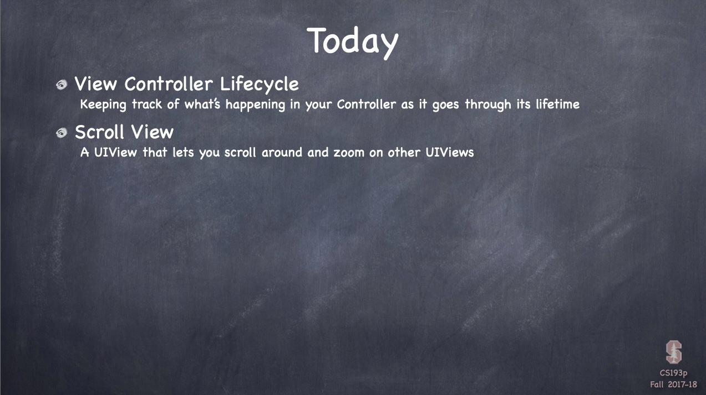
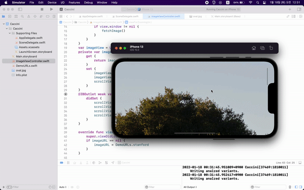
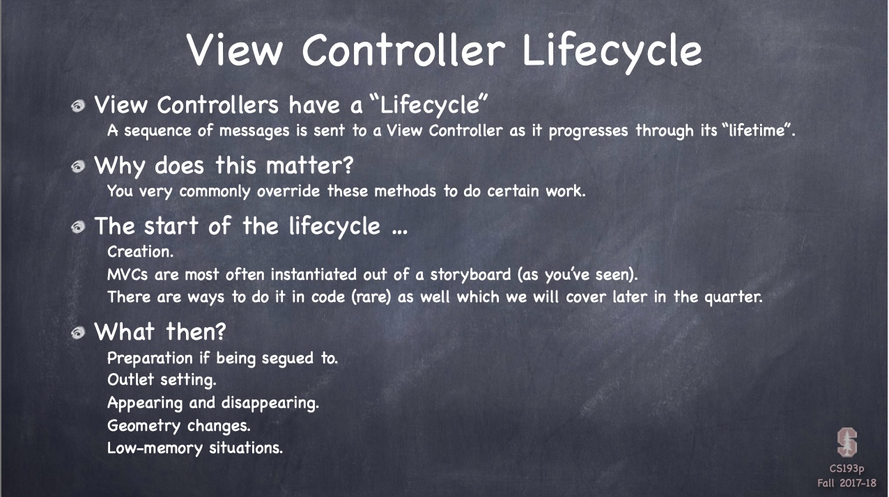
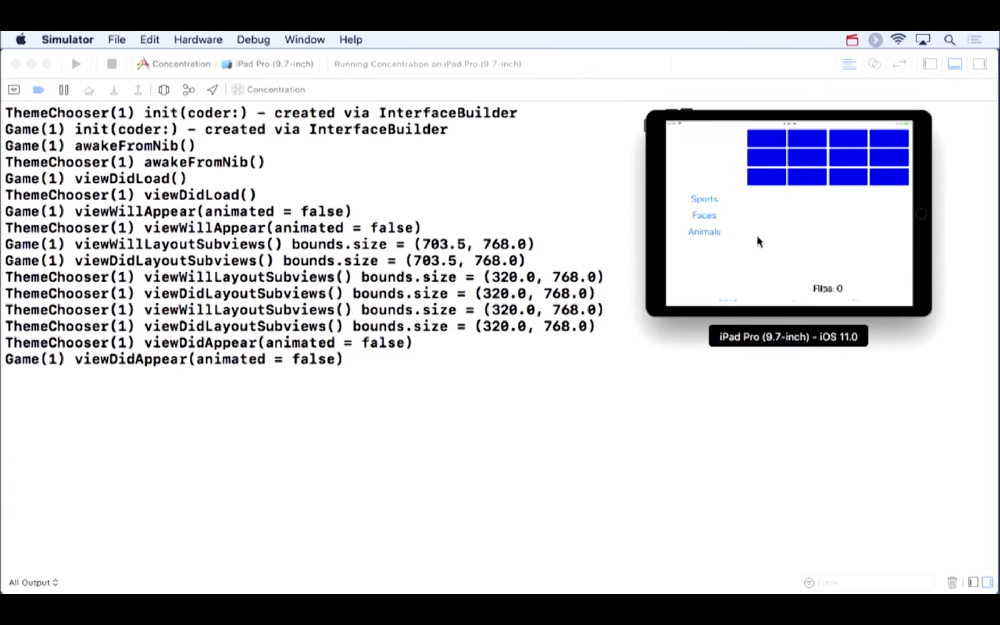
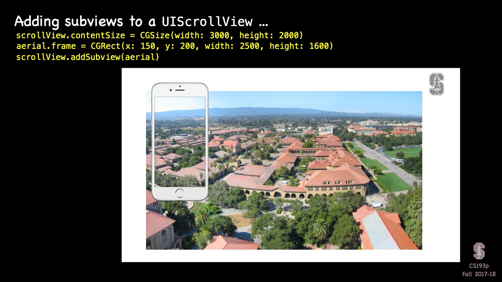
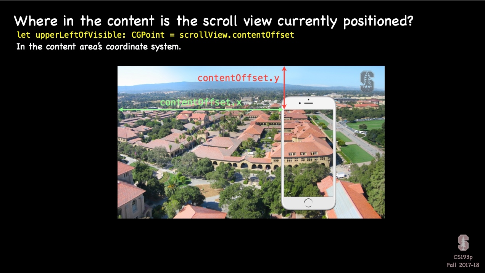
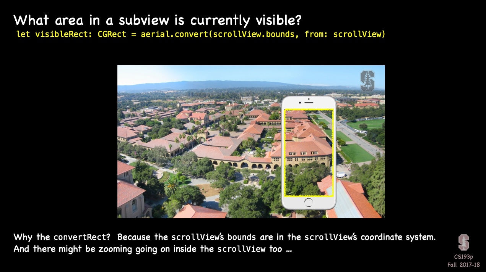
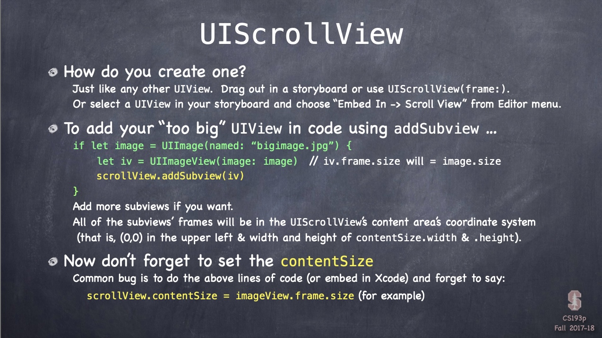
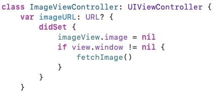
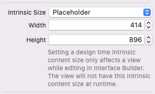

# Chapter9 : 뷰 컨트롤러의 라이프사이클과 스크롤 뷰



<br>
 <br>

## Caccini



<br>
 <br>

## Today i learned

- [View Controller Lifecycle](#View-Controller-Lifecycle)
- [Scroll View](#Scroll-View)
- [Demo](#Demo)

<br>
 <br>

### View Controller Lifecycle



- View Controller Lifecycle
    - Why does this matter
        - You may want to intervene at each stage of the View Controller lifecycle
    - The life cycle starts with
        - Creation
        - Preparation if being segued to
        - Outlet setting
        - Appearing and disappearing
        - Gemoetry changes
        - Low-memory situations

- ViewDidLoad
    - Outlets are already set
    - Good time to update View using Model
    - **Bounds are not yet set**
        - Do not geometry-related setup here

- ViewWillAppear
    - Especially model is able to change, you should make your View up to date here

- ViewDidAppear
    - Maybe start a timer or an animation
    - Do "time consuming" works here

- ViewWillDisappear
    - You may undo what you did in viewDidAppear

- ViewDidDisappear
    - Clean up MVC
    - Save things

- Geometry
    - viewWillLayoutSubviews()
    - viewDidLayoutSubviews()
        - You got notified when your top-level view's bounds change
        - **Because of Autolayout, you don't need these**

- Autorotation
    - viewWillTransition()
        - iOS automatically animate the moving of all subviews

- LowMemory
    - didReceiveMemoryWarning()

- Waking up from an storyboard
    - awakeFromNib()
    - Before outlets are set and prepareForSegue

- Summary
    - initiate
    - awakeFromNib
    - segue preparation
    - outlets get set
    - viewDidLoad
    - viewWill/DidLayoutSubviews
    - viewWill/DidAppear, viewWill/DidDisappear, 
    - didReceiveMemoryWarning



<br>
 <br>

### Scroll View

 

- Scroll View
    - You create contentSize of scrollView
        - Size of the area the scrollView will scroll around

    ```swift
    scrollView.contentSize = CGSize(width:3000, height: 2000)
    aerial.frame = CGRect(x: 2700, y: 50, width: 120, height: 180)
    scrollView.addSubview(aerial)
    ```

 

- Position, Visible area
    - `let upperLeftOfVisible: CGPoint = scrollView.contentOffset`
    - `let visibleRect: CGRect = aerial.convert(scrollView.bounds, from: scrollView)`



- Scroll View
    - Don't forget to set contentSize
    - Scrolling programmatically
        - `func scrollRectToVisible(CGRect, animated: Bool)`
    - You can show indicator by calling `flashScrollIndicators`
    - ScrollView is super smart about safe area

- Zooming
    - Zooming also affacts to contentSize and contentOffset
    - Will not work without 2 things
        - `scrollView.minimumZoomScale`
        - `scrollView.maximumZoomScale`
    - Will not work without delegate
        - `func viewForZooming(in scrollView: UIScrollView) -> UIView`
    - Zooming programatically
        - `var zoomScale: CGFloat`
        - `func setZoomScale(CGFloat, animated: Bool)`
        - `func zoom(to rect: CGRect, animated: Bool)`

<br>
 <br>

### Demo



- How can you tell if you are on screen
    - check `view.window != nil`



- You can set placeHolder's intrinc Size
