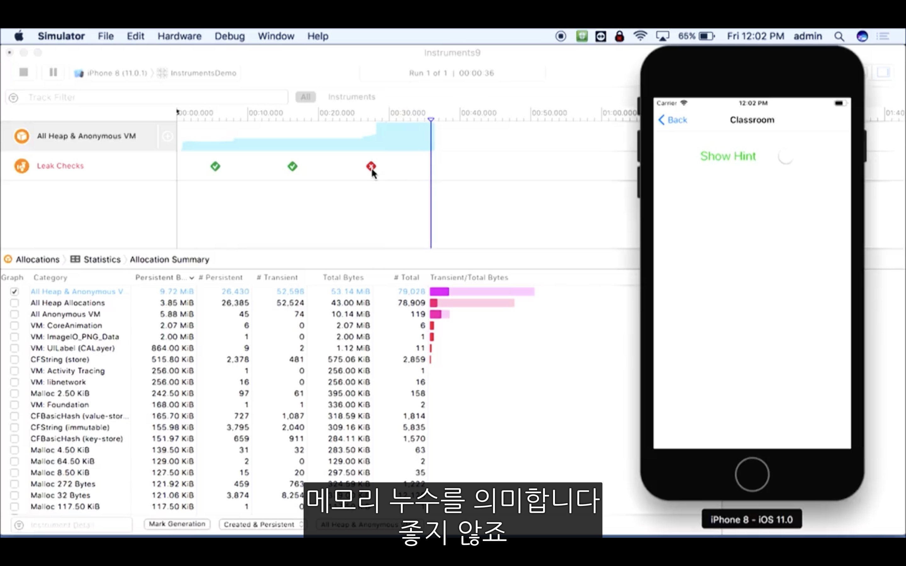

# Friday Session 3 : 인스트루먼츠

- Instruments
    - Tool which helps you how to profile code
    - Easy to use GUI on top of DTrace

- Dtrace
    - Lightweight C-like scripting language
    - To look
        - Disk I/O
        - Memory
        - Processes
        - Resources

 
  

## Contents

- [Activity Monitor](#Activity-Monitor)
- [Time Profiler](#Time-Profiler)
- [Allocations](#Allocations)
- [Leaks](#Leaks)

 
  

### Activity Monitor

- Activity Monitor
    - CPU, memory, disk and network usage
    - genaral statistics

 
  

### Time Profiler

 

- Time profiler
    - You can use to find which one takes so much time on CPU
    - Click `Call Tree` to hide system libraries
    - By `double clicking on method`, you can go into code level details

 
  

### Allocations

 

- Allocations
    - You can see how many memories are getting allocated by time

 
  

### Leaks

 
 

- Leaks
    - You can find where the memory lick occurs
    - Use this to find reference cycle
